title: Caliopen
author:
	name: Daniele Pitrolo
	e-mail: daniele@pitrolo.it
	GPG Short ID: 77DB738E
output: bglug.html

--

# 
## The Communication Manager for the Post-Snowden Era
[paf.lu/caliopenbglug](paf.lucaliopenbglug)
--
###Parliamo di…

**ME**
--
Daniele Pitrolo

[daniele@pitrolo.it](mailto:daniele@pitrolo.it)

GPG 77DB738E
--
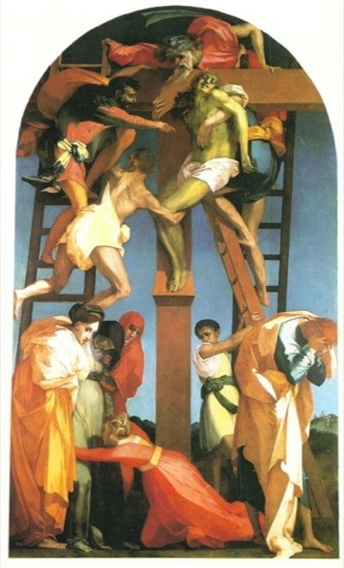
--

--
### Parliamo di…

* ~~ME~~
* Caliopen: come nasce?
--
###Laurent Chemla
[laurent@brainstorm.fr](mailto:laurent@brainstorm.fr)

[@laurentchemla](https://twitter.com/laurentchemla)

Pioniere

--
### Laurent Chemla
[laurent@brainstorm.fr](mailto:laurent@brainstorm.fr)

[@laurentchemla](https://twitter.com/laurentchemla)
#### Pioniere

* Fondatore di Gandi e pirata informatico
* Vive dentro Internet
--
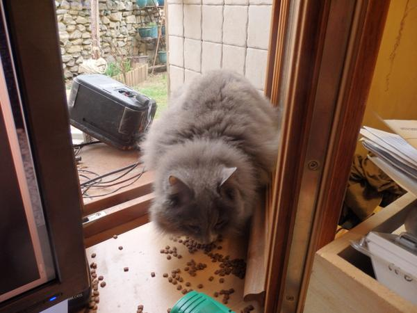
--
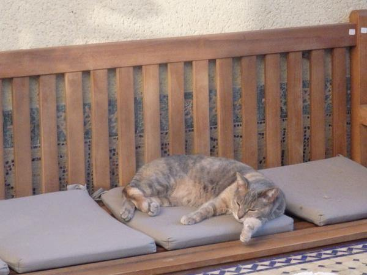
--
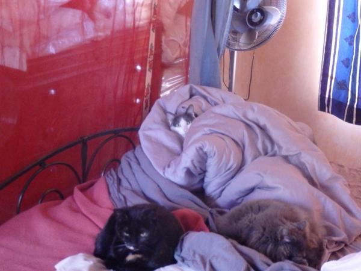
--
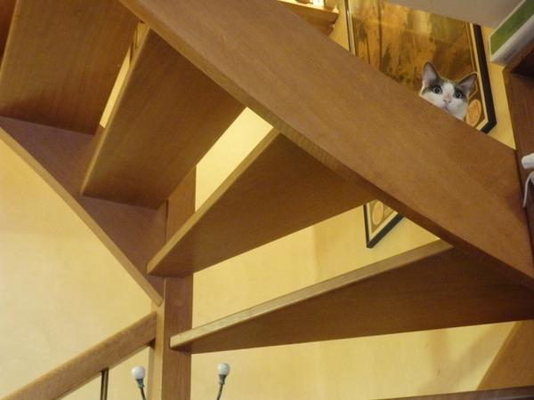
--
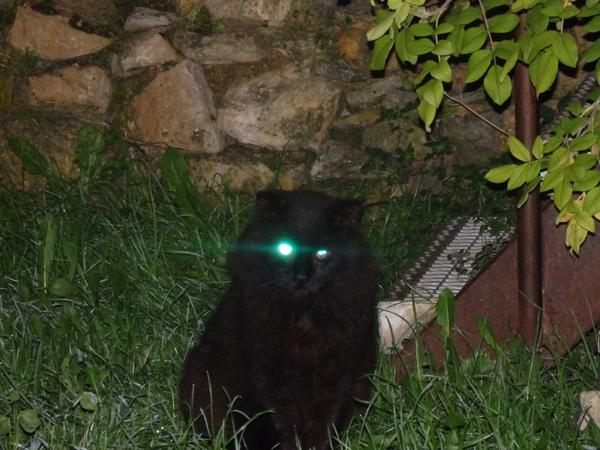
--
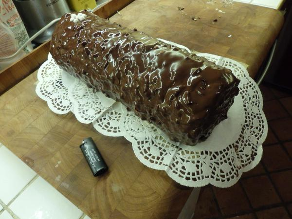
--
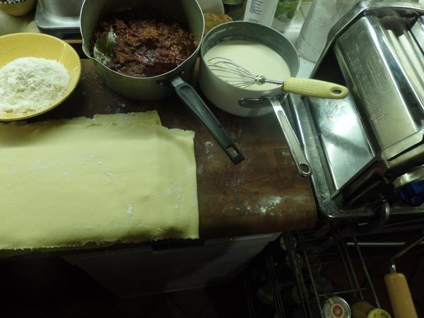
--
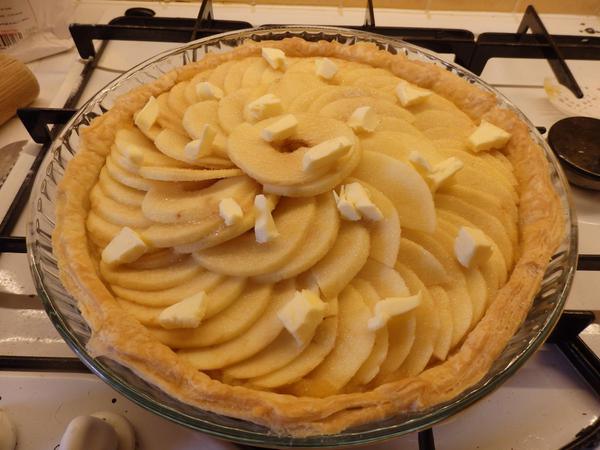
--
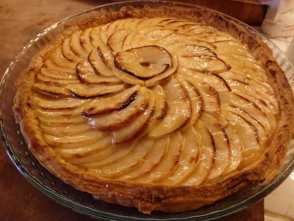
--

--

--
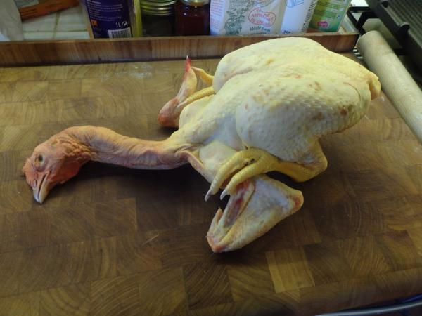
--

--

--
### Laurent Chemla

* Pioniere
* Pirata
* Gattini
* Foodporn
* Riflessioni: [Confessions d'un voleur](http://www.confessions-voleur.net/)
--
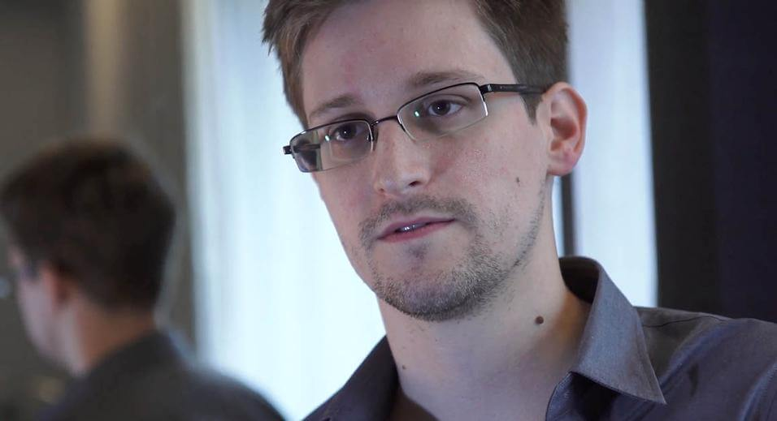
--
### Caliopen: come nasce?

~~Laurent Chemla~~

* ~~Pioniere~~
* ~~Pirata~~
* ~~Gattini~~
* ~~Foodporn~~
* ~~Riflessioni: [Confessions d'un voleur](http://www.confessions-voleur.net/)~~
--

--
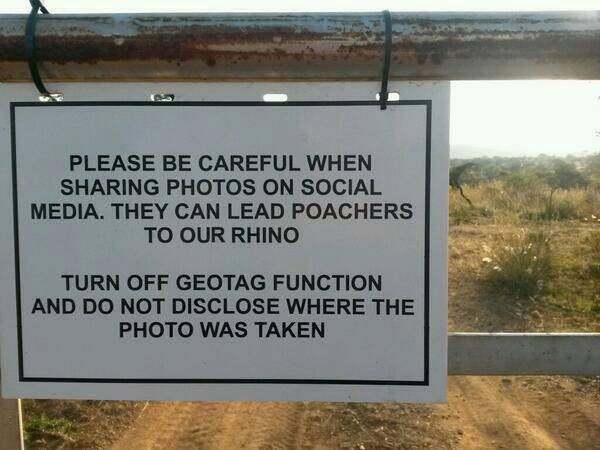
--
This agency has stalked me in my personal life, undermined my ability to trust my friends attempting to connect with me on LinkedIn, and infected my family's computer. They did this because they wanted to bypass legal channels and spy on a customer who pays for services from my employer. Wait, no, they wanted the ability to potentially spy on future customers. Actually, that is still not accurate - they wanted to spy on everybody in case there was a potentially bad person interacting with a customer.

[https://news.ycombinator.com/item?id=8905998](https://news.ycombinator.com/item?id=8905998
)
--
### Privacy: perché la perdiamo?

* tecnica
* economia
* cultura
--
### KISS
--
--

--
[https://caliopen.org/assets/mockup/createaccount.html](https://caliopen.org/assets/mockup/createaccount.html)
--
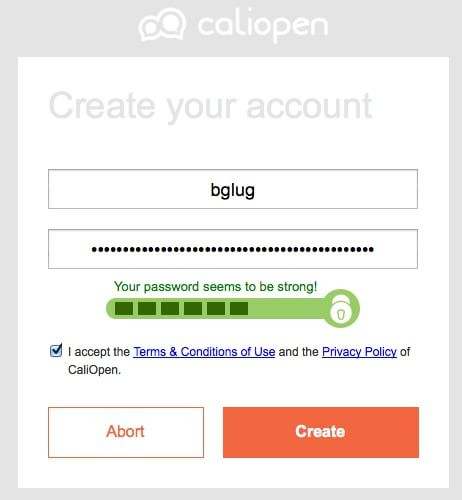
--
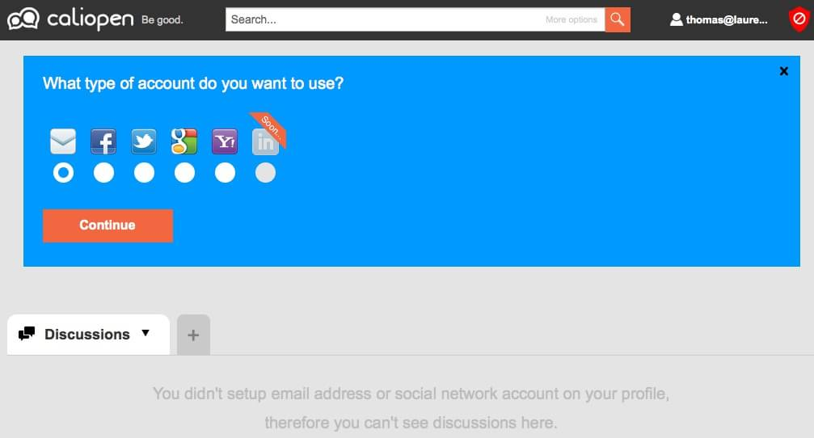
--
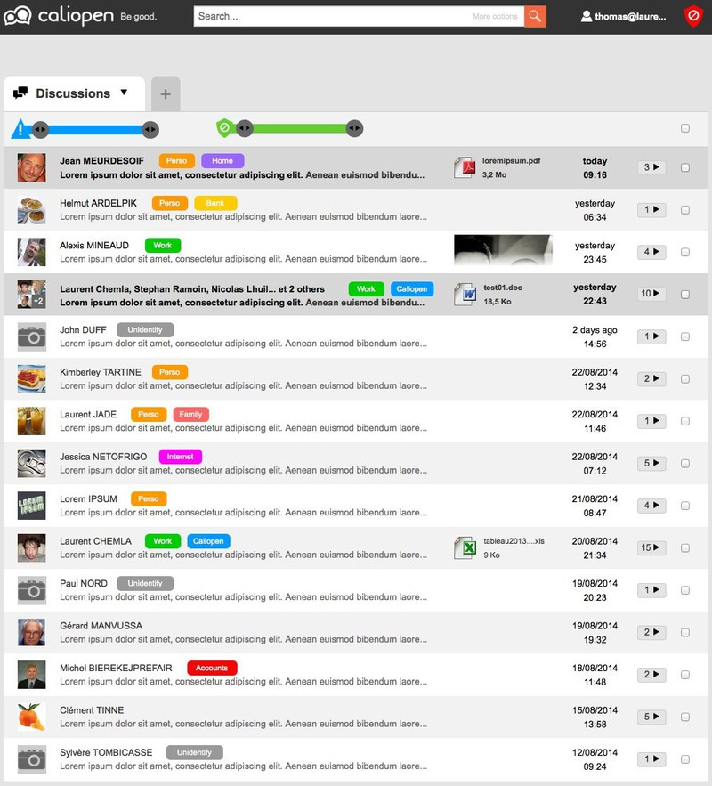
--

--
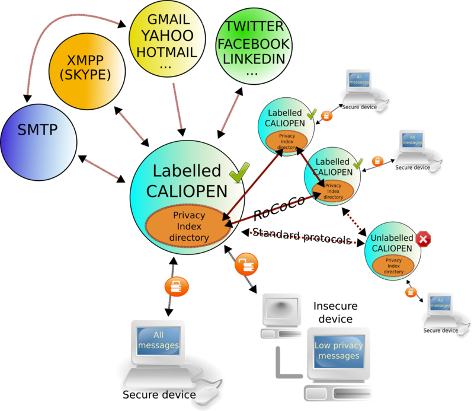
--
### Aiutarci

* front-end (ember.js)
* back-end (python)
* sysadmin
--
### Seguirci
* https://blog.caliopen.org/feed
* [@caliopen_org](https://twitter.com/caliopen_org)
* irc.freenode.org: #caliopen e #caliopdev
* [contact@caliopen.org](mailto:contact@caliopen.org)
* https://github.com/CaliOpen/
--
